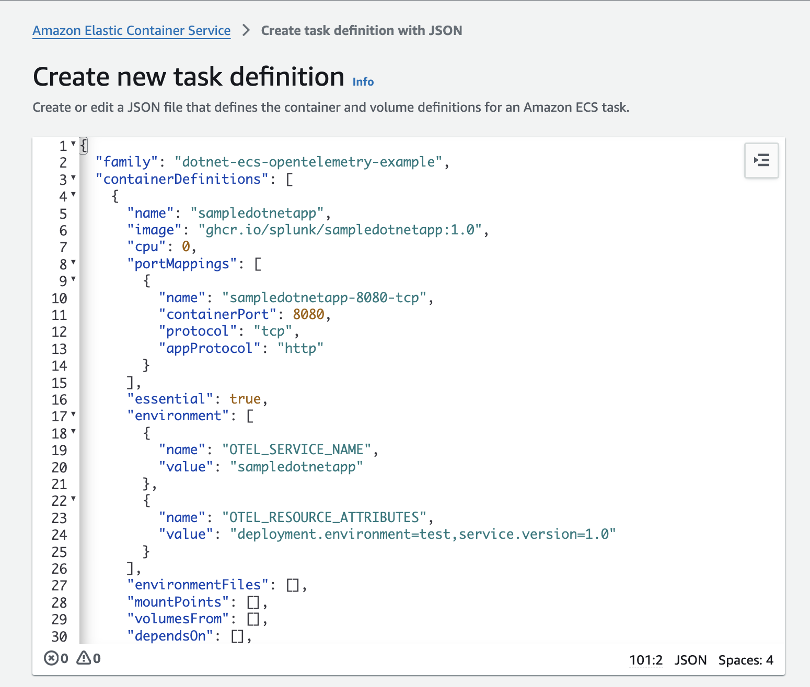
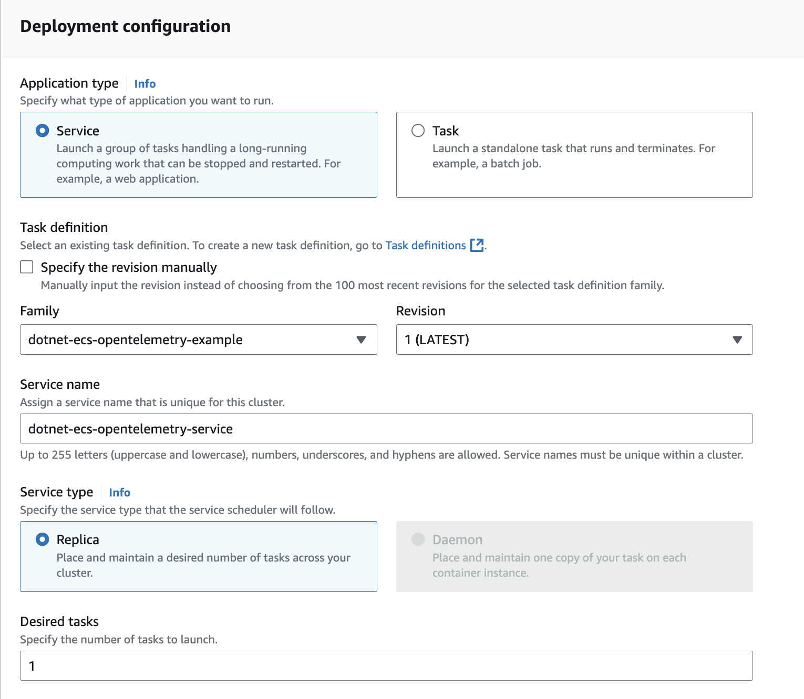
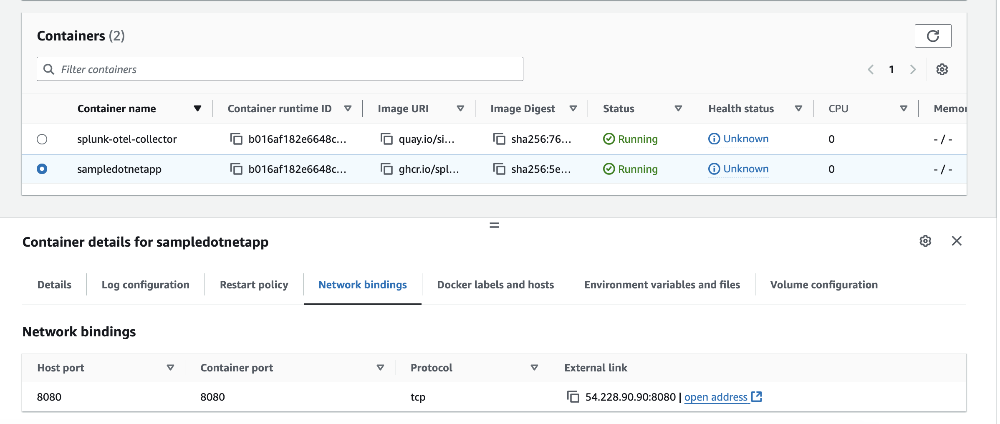
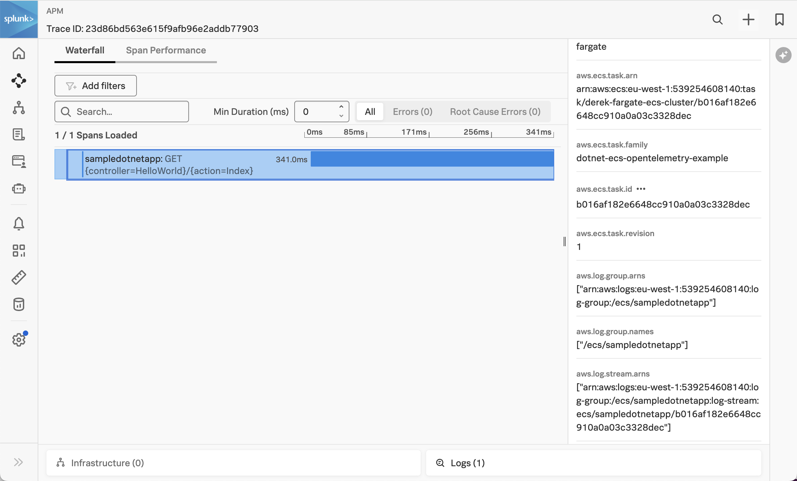
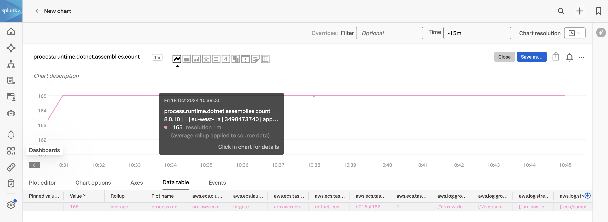
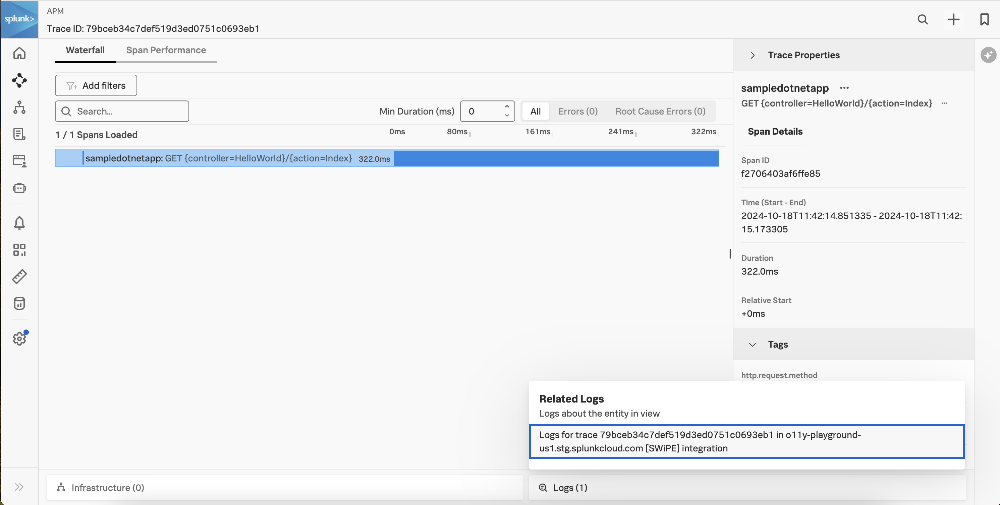
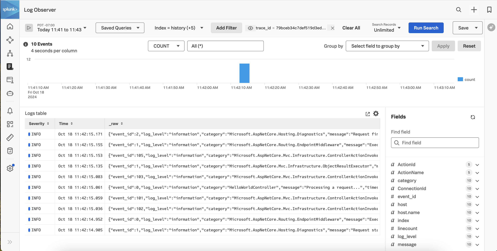

# Instrumenting a Java Application in Amazon ECS with OpenTelemetry

This example uses the same sample application and Docker image that was used in the
[dotnet/k8s](../k8s) example.

If you'd like to build your own image, please follow the steps in that example to do so.

Otherwise, we'll demonstrate how to use the existing Docker image that's
hosted in GitHub's container repository to deploy a .NET application in
Amazon ECS.

## Prerequisites

The following tools are required to build and deploy the .NET application and the
Splunk OpenTelemetry Collector:

* Docker
* Kubernetes
* Helm 3
* An AWS account with an ECS cluster and appropriate permissions

## Introduction to Amazon ECS

Amazon Elastic Container Service (Amazon ECS) is a managed orchestration service
that allows you to deploy and scale containerized applications.

It comes in two flavors:

* EC2: containers are deployed onto EC2 instances that are provisioned for your ECS cluster
* Fargate: containers are deployed in a serverless manner

We'll demonstrate how to deploy the .NET application and OpenTelemetry collector
using ECS Fargate, however EC2 is similar.

## Add the Splunk Distribution of OpenTelemetry .NET

To instrument a .NET service running in ECS Fargate with OpenTelemetry, we need to make
the .NET instrumentation available to the application.

We've already done this in the [dotnet/k8s](../k8s) example, and the container image
is available with an image name of `ghcr.io/splunk/sampledotnetapp:1.0`.

## Update the ECS Task Definition

The next step is to update the ECS Task definition for our application.

For our application container, we first need to add several environment variables:

````
   "environment": [
       {
           "name": "OTEL_SERVICE_NAME",
           "value": "sampledotnetapp"
       },
       {
           "name": "OTEL_RESOURCE_ATTRIBUTES",
           "value": "deployment.environment=test,service.version=1.0"
       },
       {
           "name": "OTEL_LOGS_EXPORTER",
           "value": "none"
       }
   ],
````

Note that we've set `OTEL_LOGS_EXPORTER` to `none` to avoid duplicate logs being exported,
as typically the log driver used by ECS will also capture logs. 

We've also configured the ECS task to use the Splunk log driver for the application container, 
which sends application logs to Splunk platform instead of AWS CloudWatch: 

````
  "logConfiguration": {
    "logDriver": "splunk",
    "options": {
      "splunk-token": "<Splunk HEC Token>",
      "splunk-url": "https://<Splunk domain>.splunkcloud.com:443",
      "splunk-index": "<Splunk Index>",
      "splunk-format": "raw",
      "tag": ""
    },
````

We then need to add a second container to the ECS task definition for the
Splunk distribution of the OpenTelemetry Collector:

````
   "name": "splunk-otel-collector",
   "image": "quay.io/signalfx/splunk-otel-collector:latest",
   "cpu": 0,
   "portMappings": [],
   "essential": true,
   "environment": [
       {
           "name": "SPLUNK_CONFIG",
           "value": "/etc/otel/collector/fargate_config.yaml"
       },
       {
           "name": "SPLUNK_REALM",
           "value": "<Realm - us0, us1, etc>"
       },
       {
           "name": "SPLUNK_ACCESS_TOKEN",
           "value": "<Access Token>"
       },
       {
           "name": "ECS_METADATA_EXCLUDED_IMAGES",
           "value": "[\"quay.io/signalfx/splunk-otel-collector:latest\"]"
       }
````

We've prepared a [task-definition.json](./task-definition.json) file that you can
use as an example.  Open this file for editing, and replace the:

* \<Splunk Realm\>
* \<Access Token\>
* \<AWS Region\>
* \<AWS Account ID\>

placeholders with appropriate values for your environment.

## Deploy to Amazon ECS

We have what we need now to deploy our task definition to Amazon ECS.

So navigate to the AWS console and go to the Amazon Elastic Container Service page.  Assuming
that you've already got an ECS cluster setup, click on Task definitions and then
Create a new task definition from JSON.  Copy and paste your task-definition.json file as
in the following screenshot:



Once the task definition is created successfully, navigate to the ECS cluster
where you'd like to deploy the application, then create a new service:

Specify "FARGATE" as the launch type:


Then configure the service deployment as follows:



While this goes beyond the scope of this example, you may need to configure
the networking details for the service, such as the VPC and subnet it belongs to,
as well as the security group to allow traffic on port 8080.  We'll configure
the service to use a public IP address and put it in a public subnet for our testing,
though in production it would be better to put a load balancer in front of the service. Refer to
[Connect Amazon ECS applications to the internet](https://docs.aws.amazon.com/AmazonECS/latest/developerguide/networking-outbound.html) for
further details.

It will take a few minutes to deploy the service.  But once it's up and running,
it should look like this in the AWS console:


Let's get the IP address for the sampledotnetapp container:



If you're using a load balancer for your deployment, then use the load balancer IP instead.

Point your browser to http://\<ECS IP Address\>:8080.

The application should look like the following:


### View Traces in Splunk Observability Cloud

After a minute or so, you should start to see traces for the Java application
appearing in Splunk Observability Cloud:



Note that the trace has been decorated with Kubernetes attributes, such as `aws.ecs.cluster.arn`.  
This allows us to retain context when we navigate from APM to
infrastructure data within Splunk Observability Cloud.

### View Metrics in Splunk Observability Cloud

Metrics are collected by the Splunk Distribution of OpenTelemetry .NET automatically.  
For example, the `process.runtime.dotnet.assemblies.count` metric shows us how many assemblies 
are loaded by the .NET CLR used by our application: 



### View Logs with Trace Context

We've included some custom code with this example to demonstrate how trace context can
be added to log entries.  You can find this code in the
[SplunkTelemetryConfiguration.cs](../k8s/SplunkTelemetryConfigurator.cs) file:

````
   public static void ConfigureLogger(ILoggingBuilder logging)
   {
       logging.AddSimpleConsole(options =>
       {
           options.IncludeScopes = true;
       });

        logging.Configure(options =>
        {
            options.ActivityTrackingOptions = ActivityTrackingOptions.SpanId
                                               | ActivityTrackingOptions.TraceId
                                               | ActivityTrackingOptions.ParentId
                                               | ActivityTrackingOptions.Baggage
                                               | ActivityTrackingOptions.Tags;
        }).AddConsole(options =>
        {
           options.FormatterName = "splunkLogsJson";
        });

        logging.AddConsoleFormatter<SplunkTelemetryConsoleFormatter, ConsoleFormatterOptions>();
   }
````

We've included a custom log formatter in the same file, to customize the
application log format.

As discussed above, we've configured the ECS task definition such that the application logs 
get sent to Splunk platform. 

We can see that the traces captured for our application include a Related Content link at the bottom right:



Clicking on this link brings us to Log Observer Connect, which filters on log entries
related to this specific trace:

