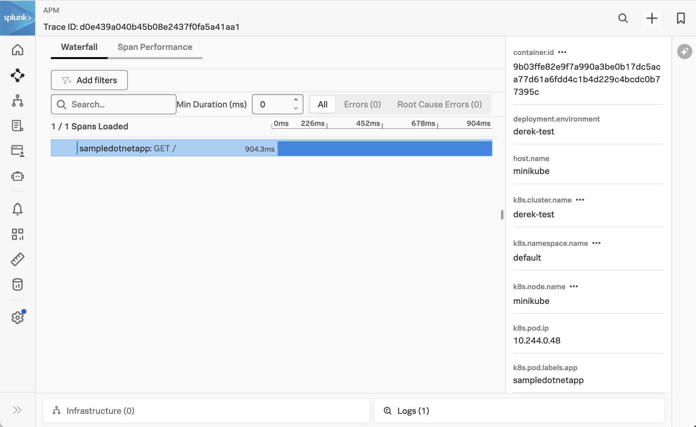
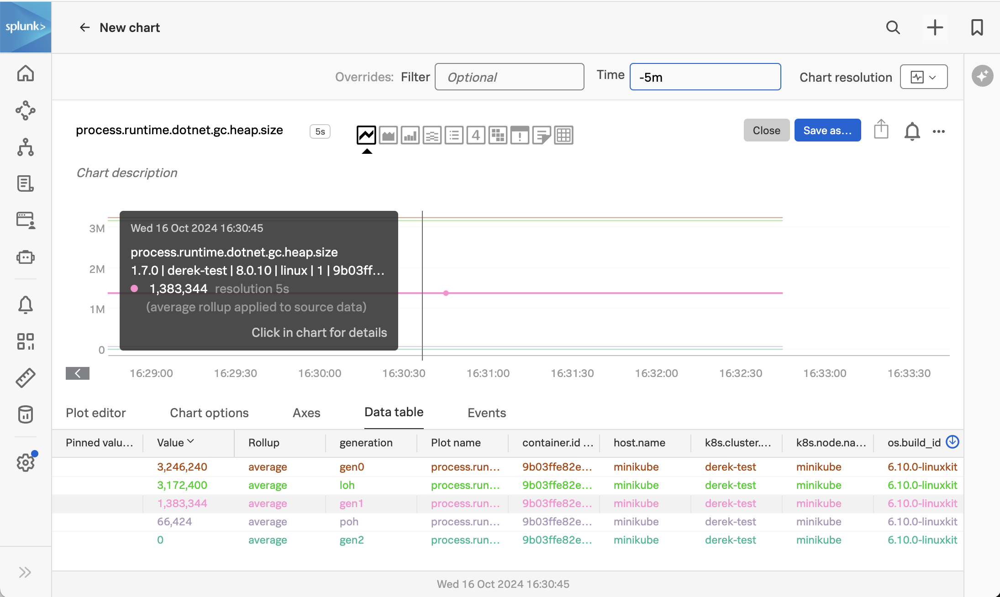
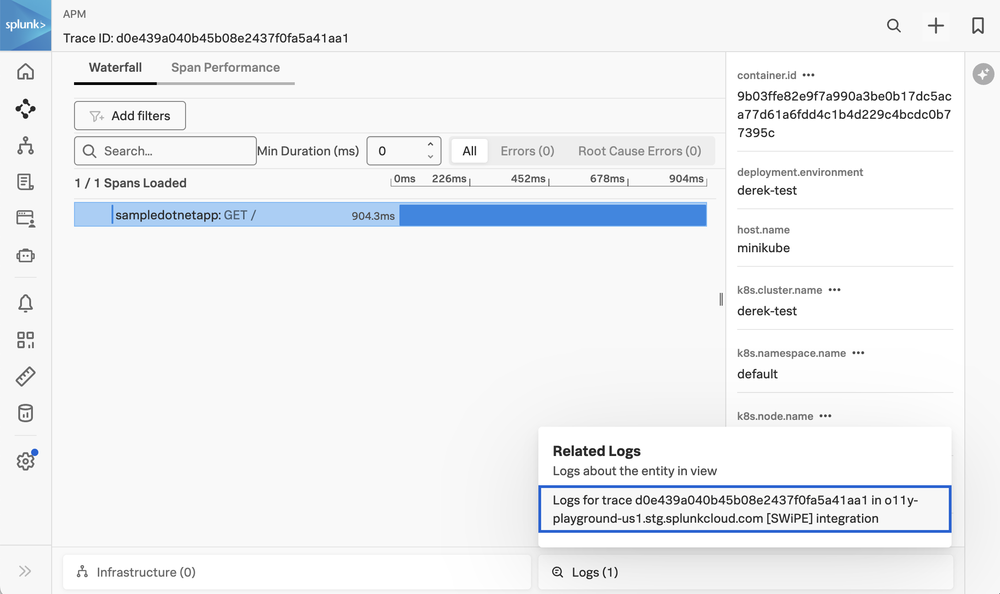
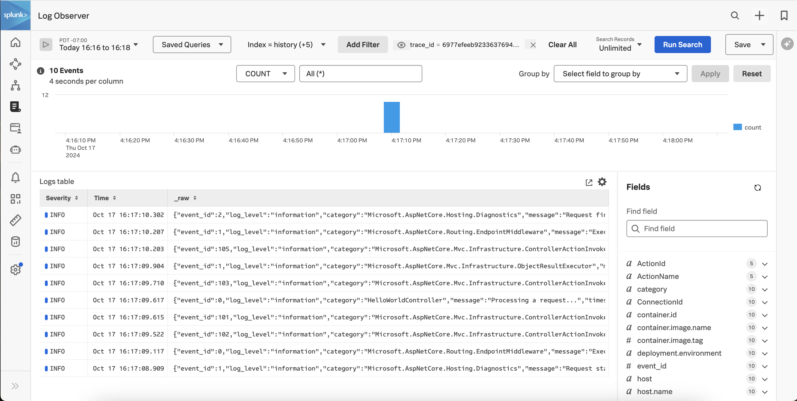

# Instrumenting a .NET Application in Kubernetes with OpenTelemetry

This example demonstrates how a .NET 8.0 core application deployed in Kubernetes 
can be instrumented with the Splunk Distribution of OpenTelemetry for .NET. 

## Prerequisites

The following tools are required to build and deploy the .NET application and the
Splunk OpenTelemetry Collector:

* Docker
* Kubernetes
* Helm 3

## Deploy the Splunk OpenTelemetry Collector

This example requires the Splunk Distribution of the OpenTelemetry collector to
be running on the host and available within the Kubernetes cluster.  Follow the
instructions in [Install the Collector for Kubernetes using Helm](https://docs.splunk.com/observability/en/gdi/opentelemetry/collector-kubernetes/install-k8s.html)
to install the collector in your k8s cluster.

If you'd like to capture logs from
the Kubernetes cluster, ensure the HEC URL and HEC token are provided when the
collector is deployed.

Here's an example command that shows how to deploy the collector in Kubernetes using Helm:

````
helm install splunk-otel-collector --set="splunkObservability.accessToken=<Access Token>,clusterName=<Cluster Name>,splunkObservability.realm=<Realm>,gateway.enabled=false,splunkPlatform.endpoint=https://<HEC URL>:443/services/collector/event,splunkPlatform.token=<HEC token>,splunkPlatform.index=<Index>,splunkObservability.profilingEnabled=true,environment=<Environment Name>" splunk-otel-collector-chart/splunk-otel-collector
````

You'll need to substitute your access token, realm, and other information.

### About the Docker image 

To run the application in K8s, we'll need a Docker image for the application.

The Docker image is constructed using a multi-stage Docker image approach, wherein
the build image is more substantial since it includes the tools required to build
the application, whereas the runtime image is lightweight and contains only what's needed
to run the application.

The installation of instrumentation is divided between different stages.
During the build step, the instrumentation is installed, and subsequently, the
outcome is transferred to the final image, eliminating the necessity for additional
dependencies specified in a separate build step.

The `entrypoint.sh` is essential for sourcing environment variables from the `instrument.sh` script,
which is included with the instrumentation. This ensures the correct setup of environment
variables for each platform.

### Build the Docker image (optional)

We've already built the Docker image for this application, so feel free to skip 
this section unless you want to use your own image.

To build the image, run the following command from the `splunk-opentelemetry-examples/instrumentation/dotnet/k8s` directory:

```
docker build --platform="linux/amd64" -f MultiStageDocker/Dockerfile -t sampledotnetapp:1.0 .
```

If you'd like to test the Docker image locally you can use the following command:

```bash
docker run -d \
  -e OTEL_DOTNET_AUTO_TRACES_CONSOLE_EXPORTER_ENABLED=true \
  -p 8181:8080 \
  sampledotnetapp:1.0
```
It will export traces to the container's stdout, so you can confirm whether traces 
are being captured using the `docker logs` command.  

Access the application by pointing your browser to `http://localhost:8181`.

### Push the Docker image (optional)

We'll then need to push the Docker image to a repository that you have
access to, such as your Docker Hub account.  We've already done this for you,
so feel free to skip this step unless you'd like to use your own image.

Specifically, we've pushed the
image to GitHub's container repository using the following commands:

````
docker tag sampledotnetapp:1.0 ghcr.io/splunk/sampledotnetapp:1.0
docker push ghcr.io/splunk/sampledotnetapp:1.0
````

See [Authenticating with a personal access token](https://docs.github.com/en/packages/working-with-a-github-packages-registry/working-with-the-container-registry#authenticating-with-a-personal-access-token-classic) 
for details on how to authenticate with GitHub before pushing the image. 

### Deploy to Kubernetes

Now that we have our Docker image, we can deploy the application to
our Kubernetes cluster.  We'll do this by using the following
kubectl command to deploy the dotnetapp.yaml manifest file:

````
kubectl apply -f ./dotnetapp.yaml
````

The Docker image already includes the Splunk Distribution of OpenTelemetry .NET file, 
and the application entry point has been modified to use `/$HOME/.splunk-otel-dotnet/instrument.sh`. 

The dotnetapp.yaml manifest file adds to this configuration by setting the following 
environment variables, to configure how the .NET agent gathers and exports data to 
the collector running within the cluster:

````
  env:
    - name: PORT
      value: "8080"
    - name: NODE_IP
      valueFrom:
        fieldRef:
          fieldPath: status.hostIP
    - name: OTEL_EXPORTER_OTLP_ENDPOINT
      value: "http://$(NODE_IP):4318"
    - name: OTEL_SERVICE_NAME
      value: "sampledotnetapp"
````

To test the application, we'll need to get the Cluster IP:

````
kubectl describe svc sampledotnetapp | grep IP:
````

Then we can access the application by pointing our browser to `http://<IP Address>:8181`.

If you're testing with minikube then use the following command to connect to the service:

````
minikube service sampledotnetapp
````

The application should look like the following:


### View Traces in Splunk Observability Cloud

After a minute or so, you should start to see traces for the .NET application
appearing in Splunk Observability Cloud:



Note that the trace has been decorated with Kubernetes attributes, such as `k8s.pod.name`
and `k8s.pod.uid`.  This allows us to retain context when we navigate from APM to
infrastructure data within Splunk Observability Cloud.

### View Metrics in Splunk Observability Cloud

Metrics are collected by the Splunk Distribution of OpenTelemetry .NET automatically.  
For example, the `process.runtime.dotnet.gc.heap.size` metric shows us the size of the 
heap used by each generation in the CLR: 



### View Logs with Trace Context

The Splunk Distribution of OpenTelemetry .NET automatically adds trace context
to logs. However, for this example we've chosen to use our own log formatter instead, 
which you can find in the SplunkTelemetryConsoleFormatter class. 

The OpenTelemetry Collector can be configured to export log data to
Splunk platform using the Splunk HEC exporter.  The logs can then be made
available to Splunk Observability Cloud using Log Observer Connect.  This will
provide full correlation between spans generated by .NET instrumentation
with metrics and logs.

Here's an example of what that looks like. We can see that the trace includes a
Related Content link at the bottom right:



Clicking on this link brings us to Log Observer Connect, which filters on log entries
related to this specific trace:



### Handling Duplicate Logs

The default configuration may result in duplicate log events sent to Splunk platform.
The first set of log events comes from the file log receiver which reads the logs
of all Kubernetes pods.  The second set of logs comes from the .NET agent, which are sent
to the collector via OTLP.

In this example, we set the `OTEL_LOGS_EXPORTER` environment variable to "none" 
to prevent the .NET agent from exporting logs.  

We also added the following custom code to the Program.cs class, which adds the trace context 
to the log entries that will be parsed by the file log receiver: 

````
builder.Logging.AddSimpleConsole(options =>
{
    options.IncludeScopes = true;
});

builder.Logging.Configure(options =>
{
    options.ActivityTrackingOptions = ActivityTrackingOptions.SpanId
                                       | ActivityTrackingOptions.TraceId
                                       | ActivityTrackingOptions.ParentId
                                       | ActivityTrackingOptions.Baggage
                                       | ActivityTrackingOptions.Tags;
});
````