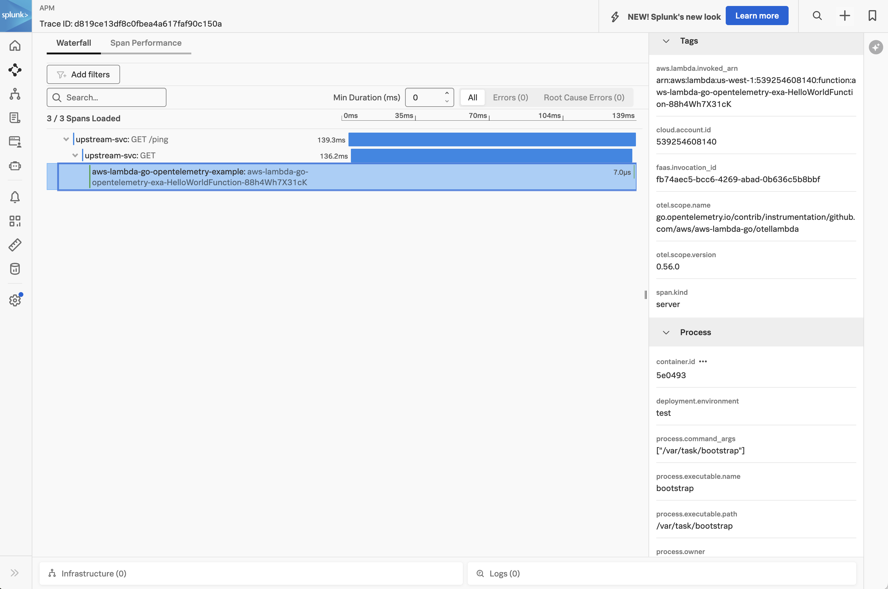
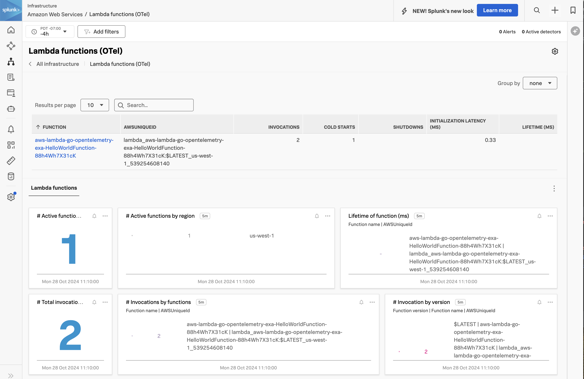

# Instrumenting a Go AWS Lambda Function with OpenTelemetry

This example demonstrates how to instrument an AWS Lambda function written in
Go using OpenTelemetry, and then export the data to Splunk Observability
Cloud.  We'll use Go 1.21 for this example, but the steps for other Go versions
are similar.  The example also uses the AWS Serverless Application Model (SAM)
CLI to deploy the Lambda function and an associated API Gateway to access it.

## Prerequisites

The following tools are required to deploy Go functions into AWS Lambda using SAM:

* An AWS account with permissions to create and execute Lambda functions
* Go 1.21
* Download and install [AWS SAM](https://docs.aws.amazon.com/serverless-application-model/latest/developerguide/install-sam-cli.html)

## Application Overview (optional)

If you just want to build and deploy the example, feel free to skip this section.

The application used here is based on the "Hello World" example application that's part of the
[AWS Quick Start templates](https://docs.aws.amazon.com/serverless-application-model/latest/developerguide/using-sam-cli-init.html).

We also added the SPLUNK_ACCESS_TOKEN and SPLUNK_REALM environment variables to the
template.yaml.base file, as well as multiple layers which provide the instrumentation,
as discussed below.

### Install Go Modules 

We used the following commands to add the Go modules required to instrument this application
with OpenTelemetry.  Please note that this doesn't need to be executed again, but is provided for reference in case 
you'd like to apply instrumentation to your own application: 

````
cd ~/splunk-opentelemetry-examples/instrumentation/go/aws-lambda/hello-world
go get github.com/aws/aws-lambda-go/events
go get github.com/signalfx/splunk-otel-go/distro
go get -u go.opentelemetry.io/contrib/instrumentation/github.com/aws/aws-lambda-go/otellambda
go get go.opentelemetry.io/contrib/bridges/otelzap
````

### Instrument the Go Lambda Function

To instrument the Go lambda function, we added the following code to the `main` function: 

````
func main() {
	ctx := context.Background()

	sdk, err := distro.Run()
	if err != nil {
		panic(err)
	}
	// Flush all spans before the application exits
	defer func() {
		if err := sdk.Shutdown(ctx); err != nil {
			panic(err)
		}
	}()

    logger, err = zap.NewProduction()
    if err != nil {
            panic(err)
    }
    defer logger.Sync()
    
    flusher := otel.GetTracerProvider().(otellambda.Flusher)

	lambda.Start(
	    otellambda.InstrumentHandler(handler,
            otellambda.WithFlusher(flusher),
            otellambda.WithEventToCarrier(customEventToCarrier)))
}
````

This activates the Splunk distribution of OpenTelemetry Go and instruments the Lambda handler with 
the `otellambda` module. 

The `WithFlusher` option ensures the `ForceFlush` method is called at the end of each 
Lambda function invocation, which important for functions with asynchronous 
logic as it ensures that spans are sent to the collector before the Lambda function freezes. 

We also added the `WithEventToCarrier` option to ensure a trace context is handled as expected 
(see below for further details on this topic). 

Finally, we created a logger using [zap](https://github.com/uber-go/zap), which we'll explain in more detail below. 

### Trace Context Propagation 

When instrumenting a Go Lambda function like the example presented here 
that's fronted by AWS API Gateway with OpenTelemetry, 
trace context is not automatically propagated.  So if the client of the Lambda function
is instrumented with OpenTelemetry, and the traceparent header is added to the HTTP request
by the OpenTelemetry SDK, this will *not* be read automatically by the
[OpenTelemetry AWS Lambda Instrumentation for Golang implementation](https://github.com/open-telemetry/opentelemetry-go-contrib/tree/instrumentation/github.com/aws/aws-lambda-go/otellambda/example/v0.53.0/instrumentation/github.com/aws/aws-lambda-go/otellambda).

To get trace context propagation working successfully in this scenario, we had to tell
the `otellambda` instrumentation how to extract the `traceparent` header from the
APIGatewayProxyRequest event object that gets passed to the handler.  This was done
with the following code:

````
var traceparent = http.CanonicalHeaderKey("traceparent")

func customEventToCarrier(eventJSON []byte) propagation.TextMapCarrier {
	var request events.APIGatewayProxyRequest
	_ = json.Unmarshal(eventJSON, &request)

	var header = http.Header{
		traceparent: []string{request.Headers["traceparent"]},
	}

	return propagation.HeaderCarrier(header)
}
````

Then we needed to specify this function when we instrument the handler
with `otellambda`:

````
	lambda.Start(
	    otellambda.InstrumentHandler(handler,
            otellambda.WithFlusher(flusher),
            otellambda.WithEventToCarrier(customEventToCarrier)))
````

Refer to the [documentation](https://github.com/open-telemetry/opentelemetry-go-contrib/tree/main/instrumentation/github.com/aws/aws-lambda-go/otellambda)
for further explanation on WithEventToCarrier.

### Customizations to Add Trace Context to Logs 

Additional code is required in our example to ensure that the trace context, 
which includes the trace_id and span_id attributes, is added to logs generated
by our application.  We followed the example in 
[Connect Go trace data with logs for Splunk Observability Cloud](https://docs.splunk.com/observability/en/gdi/get-data-in/application/go/instrumentation/connect-traces-logs.html)
to implement this, and adapted it for AWS Lambda. 

It requires adding a helper function to extract the trace context from the context.Context object: 

````
func withTraceMetadata(ctx context.Context, logger *zap.Logger) *zap.Logger {
        spanContext := trace.SpanContextFromContext(ctx)
        if !spanContext.IsValid() {
                // ctx does not contain a valid span.
                // There is no trace metadata to add.
                return logger
        }
        return logger.With(
                zap.String("trace_id", spanContext.TraceID().String()),
                zap.String("span_id", spanContext.SpanID().String()),
                zap.String("trace_flags", spanContext.TraceFlags().String()),
        )
}
````

We then use the helper function in the lambda handler to create a custom logger: 

````
func handler(ctx context.Context, request events.APIGatewayProxyRequest) (events.APIGatewayProxyResponse, error) {

    loggerWithTraceContext := withTraceMetadata(ctx, logger)
````

Now when we use the custom logger in the handler, the trace context will be added: 

````
	loggerWithTraceContext.Info("About to retrieve the SourceIP")
````

## Build and Deploy

Open a command line terminal and navigate to the root of the directory.  
For example:

````
cd ~/splunk-opentelemetry-examples/instrumentation/go/aws-lambda
````

### Provide your AWS credentials

````
export AWS_ACCESS_KEY_ID="<put the access key ID here>"
export AWS_SECRET_ACCESS_KEY="<put the secret access key here>"
export AWS_SESSION_TOKEN="<put the session token here>"
````

### Add the Splunk Lambda layers

Let's first make a copy of the template.yaml.base file:

````
cp template.yaml.base template.yaml
````

#### Add the Splunk OpenTelemetry Collector layer

Our example deploys the Splunk distribution of the OpenTelemetry collector
to a separate layer within the lambda function.  Lookup the ARN for your
region in Step 6 in [this document](https://docs.splunk.com/observability/en/gdi/get-data-in/serverless/aws/otel-lambda-layer/instrumentation/lambda-language-layers.html#install-the-aws-lambda-layer-for-your-language).

and add the ARN there.  For example,
here's the ARN for us-west-1:

````
      Layers:
        - arn:aws:lambda:us-west-1:254067382080:layer:splunk-apm-collector:10
````

#### Add the Splunk Metrics Extension Layer

Optionally, we can also add the Splunk Metrics Extension Layer to the template.yaml file.
Lookup the ARN for your
region in Step 7 in [this document](https://docs.splunk.com/observability/en/gdi/get-data-in/serverless/aws/otel-lambda-layer/instrumentation/lambda-language-layers.html#install-the-aws-lambda-layer-for-your-language).

````
      Layers:
        - arn:aws:lambda:us-west-1:254067382080:layer:splunk-apm-collector:10
        - arn:aws:lambda:us-west-1:254067382080:layer:splunk-lambda-metrics:10
````

### Add the Splunk Observability Cloud Access Token and Realm

We'll also need to specify the realm and access token for the target
Splunk Observability Cloud environment.  This goes in the template.yaml
file as well:

````
  Environment: 
    Variables:
      SPLUNK_ACCESS_TOKEN: <access token>
      SPLUNK_REALM: us1
      OTEL_RESOURCE_ATTRIBUTES: deployment.environment=test
````

### Build the SAM Function

Next, we'll build the function using SAM:

````
sam build
````
### Deploy the SAM Function

Then deploy it:

````
sam deploy --guided
````

You'll be asked a number of questions along the way.  Here are sample responses,
but you should provide the desired stack name and AWS region for your lambda
function.

````
Setting default arguments for 'sam deploy'
=========================================
Stack Name [sam-app]: aws-lambda-go-opentelemetry-example
AWS Region [us-west-1]: us-west-1
#Shows you resources changes to be deployed and require a 'Y' to initiate deploy
Confirm changes before deploy [y/N]: y
#SAM needs permission to be able to create roles to connect to the resources in your template
Allow SAM CLI IAM role creation [Y/n]: y
#Preserves the state of previously provisioned resources when an operation fails
Disable rollback [y/N]: n
HelloWorldFunction has no authentication. Is this okay? [y/N]: y
Save arguments to configuration file [Y/n]: y
SAM configuration file [samconfig.toml]: 
SAM configuration environment [default]: 
````

It will take a few moments for SAM to create all of the objects necessary to
support your lambda function.  Once it's ready, it will provide you with an API
Gateway Endpoint URL that uses the following format:

````
https://${ServerlessRestApi}.execute-api.${AWS::Region}.amazonaws.com/Prod/hello/
````

### Test the SAM Function

Use the API Gateway Endpoint URL provided in the previous step to test the SAM function.
You should see a response such as the following:

````
Hello, 97.113.91.239!
````

### View Traces in Splunk Observability Cloud

After a minute or so, you should start to see traces for the lambda function
appearing in Splunk Observability Cloud:



In this trace, we can see that trace context is preserved when an upstream service calls 
the Go Lambda function.  

### View Metrics in Splunk Observability Cloud

If you added the Splunk Metrics Extension Layer, you'll also see metrics for your
lambda function by navigating to Infrastructure -> Lambda functions (OTel) and
then selecting your lambda function:



### Add Trace Context to Logs

Logs generated by an AWS Lambda function get sent to AWS CloudWatch.
Various methods exist for ingesting logs into Splunk platform from AWS CloudWatch,
such as the solution described in
[Stream Amazon CloudWatch Logs to Splunk Using AWS Lambda](https://www.splunk.com/en_us/blog/platform/stream-amazon-cloudwatch-logs-to-splunk-using-aws-lambda.html).

Once the logs are in Splunk platform, they can be made available to
Splunk Observability Cloud using Log Observer Connect.

In the following example,
we can see that the trace context was injected successfully into the logs
using the custom logging changes described above:

````
{
    "level": "info",
    "ts": 1730214493.1110091,
    "caller": "hello-world/main.go:28",
    "msg": "About to retrieve the SourceIP",
    "trace_id": "d1bccf2cfab08458d1b9e3d68ab31bdc",
    "span_id": "a69578b933416aa1",
    "trace_flags": "01"
}

````

This will ensure full correlation between traces generated by AWS Lambda instrumentation
with metrics and logs. 