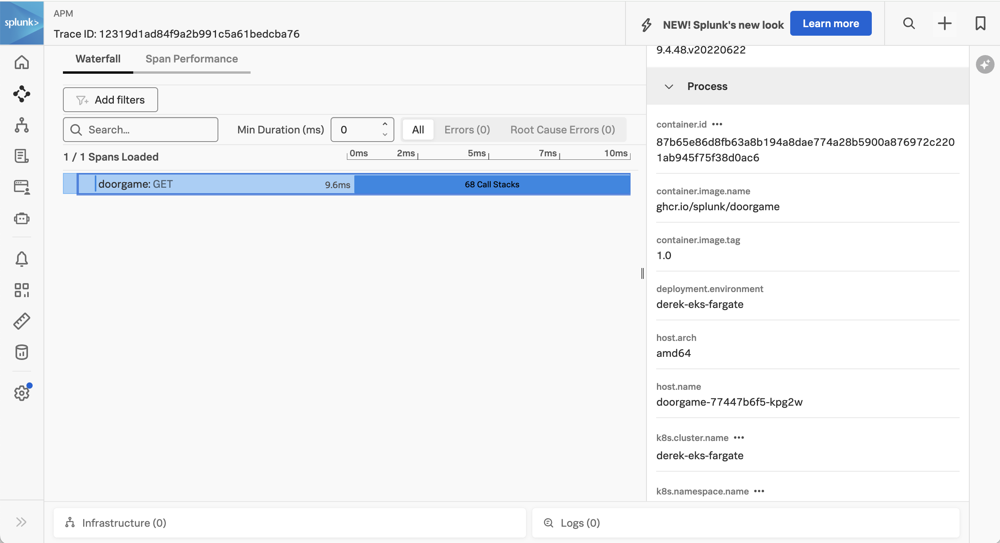
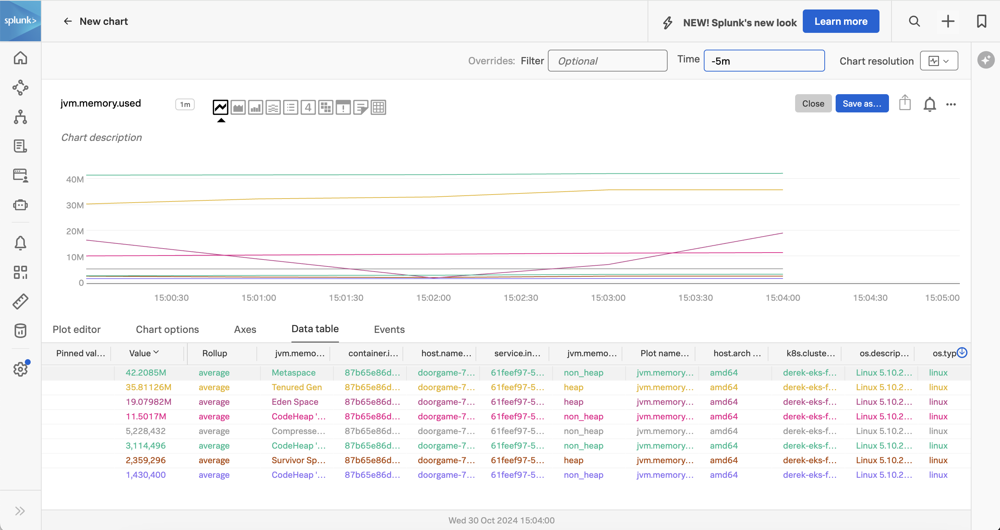
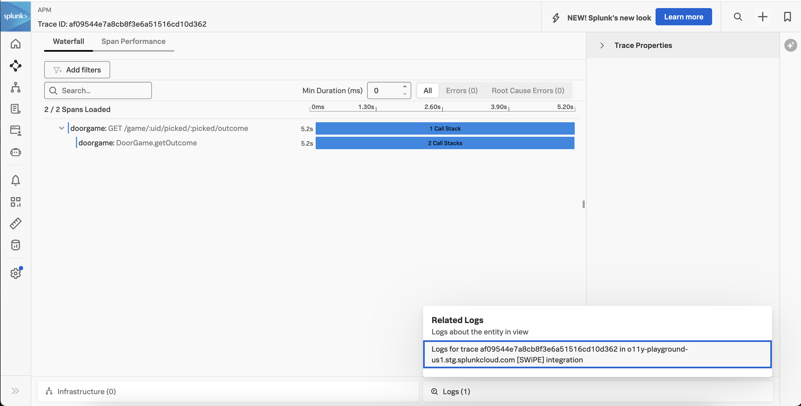

# Instrumenting a Java Application in Amazon EKS Fargate with OpenTelemetry

This example uses the same sample application that is used in the
[java/linux](../linux) example.

It also uses the Docker image that was built for this sample application
in the [java/k8s](../k8s) example.  If you'd like to build your own image,
then please follow the steps in that example to do so.

Otherwise, we'll demonstrate how to use the existing Docker image that's
hosted in GitHub's container repository to deploy a Java application in
Amazon EKS Fargate.

## Prerequisites

The following tools are required to build and deploy the Java application and the
Splunk OpenTelemetry Collector:

* Docker
* Kubernetes
* Helm 3 
* An AWS account with an EKS Fargate cluster and appropriate permissions

## Introduction to Amazon EKS

Amazon Elastic Kubernetes Service (Amazon EKS) is a managed Kubernetes service
that allows you to deploy and scale containerized applications.

It comes in two flavors:

* EC2: containers are deployed onto EC2 instances that are provisioned for your EKS cluster
* Fargate: containers are deployed in a serverless manner

We'll demonstrate how to deploy the Java application and OpenTelemetry collector
using EKS Fargate, however EC2 is similar.

If you don't already have an EKS Fargate cluster provisioned, follow the instructions in 
[Get started with Amazon EKS – eksctl](https://docs.aws.amazon.com/eks/latest/userguide/getting-started-eksctl.html) 
to do so. 

## Install the AWS Load Balancer Controller

This example assumes that the AWS Load Balancer Controller is installed in the Fargate cluster. 

See 
[Install AWS Load Balancer Controller with Helm](https://docs.aws.amazon.com/eks/latest/userguide/lbc-helm.html) 
to install it, if required. 

## Deploy the Splunk OpenTelemetry Collector

This example requires the Splunk Distribution of the OpenTelemetry collector to
be running in the EKS cluster.  

We'll use Helm to deploy the collector in our Amazon EKS cluster. To do this, 
we've set the required distribution value to `eks/fargate`:

````
cloudProvider=aws,distribution=eks/fargate,gateway.enabled=true
````

The OpenTelemetry Collector agent daemonset is not created since Fargate does not support daemonsets.
For this reason, we've set`gateway.enabled=true` and will use the gateway collector to capture 
metrics, traces, and logs from the application instead of an agent collector.

Here's an example command that shows how to deploy the collector in EKS Fargate using Helm:

````
helm install splunk-otel-collector --set="cloudProvider=aws,distribution=eks/fargate,splunkObservability.accessToken=***,clusterName=<Cluster Name>,splunkObservability.realm=<Realm>,gateway.enabled=true,splunkPlatform.endpoint=https://<HEC URL>.splunkcloud.com:443/services/collector/event,splunkPlatform.token=***,splunkPlatform.index=<Index>,splunkObservability.profilingEnabled=true,environment=<Environment Name>" splunk-otel-collector-chart/splunk-otel-collector
````

You'll need to substitute your access token, realm, and other information.

Please refer to 
[Configure Amazon Elastic Kubernetes Service Fargate](https://docs.splunk.com/observability/en/gdi/opentelemetry/collector-kubernetes/kubernetes-config.html#configure-amazon-elastic-kubernetes-service-fargate) 
for further details. 

## Build and Execute the Application

Open a command line terminal and navigate to the root of the directory.  
For example:

````
cd ~/splunk-opentelemetry-examples/instrumentation/java/aws-eks-fargate
````

### Deploy to Kubernetes

Now that we have our Docker image, we can deploy the application to
our Kubernetes cluster.  We'll do this by using the following
kubectl command to deploy the doorgame-eks.yaml manifest file:

````
kubectl apply -f ./doorgame-eks.yaml
````

The Docker image already includes the splunk-otel-javaagent.jar file, and adds it
to the Java startup command.  The doorgame-eks.yaml manifest file adds to this
configuration by setting the following environment variables, to configure how the
Java agent gathers and exports data to the collector running within the cluster:

````
  env:
    - name: PORT
      value: "9090"
    - name: OTEL_EXPORTER_OTLP_ENDPOINT
      value: "http://splunk-otel-collector:4318"
    - name: OTEL_SERVICE_NAME
      value: "doorgame"
    - name: OTEL_PROPAGATORS
      value: "tracecontext,baggage"
    - name: SPLUNK_PROFILER_ENABLED
      value: "true"
    - name: SPLUNK_PROFILER_MEMORY_ENABLED
      value: "true"
````

Note that we've used the gateway collector address to populate `OTEL_EXPORTER_OTLP_ENDPOINT`, 
since the agent collector is not deployed in an EKS Fargate environment as noted above. 

To test the application, we'll need to get the Load Balancer DNS name: 

````
kubectl get ingress   
````

It will return something like the following: 

````
NAME               CLASS   HOSTS   ADDRESS                                                                 PORTS   AGE
doorgame-ingress   alb     *       k8s-default-doorgame-4417858106-224637253.eu-west-1.elb.amazonaws.com   80      5m15s
````

Then we can access the application by pointing our browser to `http://k8s-default-doorgame-4417858106-224637253.eu-west-1.elb.amazonaws.com`.

Note that it will take a few minutes for the load balancer to be created in AWS. 

The application should look like the following:


### View Traces in Splunk Observability Cloud

After a minute or so, you should start to see traces for the Java application
appearing in Splunk Observability Cloud:



Note that the trace has been decorated with Kubernetes attributes, such as `k8s.pod.name`
and `k8s.pod.uid`.  This allows us to retain context when we navigate from APM to
infrastructure data within Splunk Observability Cloud.

### View Metrics in Splunk Observability Cloud

Metrics are collected by splunk-otel-javaagent.jar automatically.  For example,
the `jvm.memory.used` metric shows us the amount of memory used in the JVM
by type of memory:



### View Logs with Trace Context

The Splunk Distribution of OpenTelemetry Java automatically adds trace context
to logs.  

We configured the OpenTelemetry Collector to export log data to
Splunk platform using the Splunk HEC exporter.  The logs can then be made
available to Splunk Observability Cloud using Log Observer Connect.  This will
provide full correlation between spans generated by Java instrumentation
with metrics and logs.

Here's an example of what that looks like. We can see that the trace includes a
Related Content link at the bottom right:



Clicking on this link brings us to Log Observer Connect, which filters on log entries
related to this specific trace:


