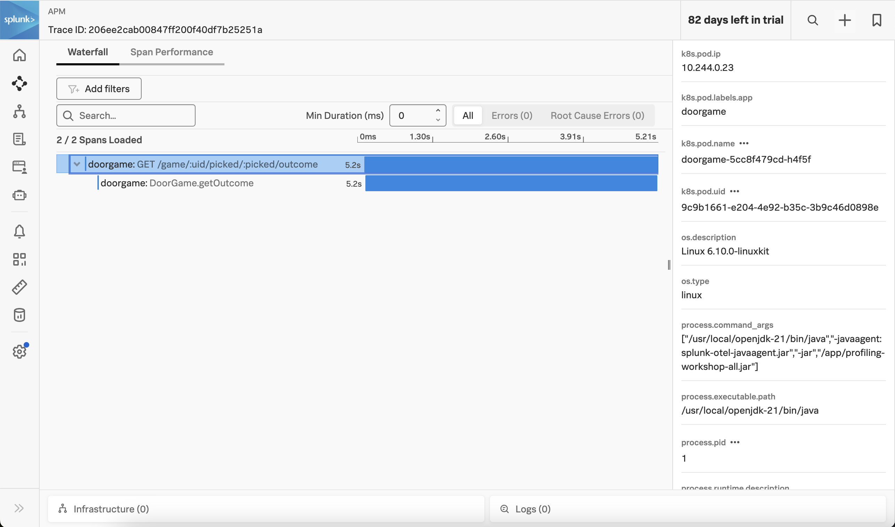

# Instrumenting a Java Application in Kubernetes with OpenTelemetry

This example uses the same sample application that is used in the 
[java/linux](../linux) example. 

## Prerequisites

The following tools are required to build and deploy the Java application and the 
Splunk OpenTelemetry Collector: 

* Docker
* Kubernetes  
* Helm 3

## Deploy the Splunk OpenTelemetry Collector

This example requires the Splunk Distribution of the OpenTelemetry collector to
be running on the host and available within the Kubernetes cluster.  Follow the
instructions in [Install the Collector for Kubernetes using Helm](https://docs.splunk.com/observability/en/gdi/opentelemetry/collector-kubernetes/install-k8s.html)
to install the collector in your k8s cluster. 

## Build and Execute the Application

Open a command line terminal and navigate to the root of the directory.  
For example:

````
cd ~/splunk-opentelemetry-examples/instrumentation/java/linux
````

### Build the Docker image (optional)

To run the application in K8s, we'll need a Docker image for the application. 
We've already built one, so feel free to skip this section unless you want to use
your own image. 

You can use the following command to build the Docker image: 

````
docker build --platform="linux/amd64" -t doorgame:1.0 doorgame
````

Note that the Dockerfile adds the latest version of the Splunk Java agent 
to the container image, and then includes it as part of the java startup 
command when the container is launched: 

````
# Adds the latest version of the Splunk Java agent
ADD https://github.com/signalfx/splunk-otel-java/releases/latest/download/splunk-otel-javaagent.jar .

# Modifies the entry point
ENTRYPOINT ["java","-javaagent:splunk-otel-javaagent.jar","-jar","/app/profiling-workshop-all.jar"]
````

If you'd like to test the Docker image locally you can use: 

````
docker run -p 9090:9090 doorgame:1.0 
````

Then access the application by pointing your browser to `http://localhost:9090`. 

### Push the Docker image (optional)

We'll then need to push the Docker image to a repository that you have 
access to, such as your Docker Hub account.  We've already done this for you,
so feel free to skip this step unless you'd like to use your own image.

Specifically, we've pushed the 
image to GitHub's container repository using the following commands: 

````
docker tag doorgame:1.0 ghcr.io/splunk/doorgame:1.0
docker push ghcr.io/splunk/doorgame:1.0
````

### Deploy to Kubernetes

Now that we have our Docker image, we can deploy the application to
our Kubernetes cluster.  We'll do this by using the following 
kubectl command to deploy the doorgame.yaml manifest file: 

````
kubectl apply -f ./doorgame/doorgame.yaml
````

The Docker image already includes the splunk-otel-javaagent.jar file, and adds it
to the Java startup command.  The doorgame.yaml manifest file adds to this 
configuration by setting the following environment variables, to configure how the 
Java agent gathers and exports data to the collector running within the cluster: 

````
  env:
    - name: PORT
      value: "9090"
    - name: NODE_IP
      valueFrom:
        fieldRef:
          fieldPath: status.hostIP
    - name: OTEL_EXPORTER_OTLP_ENDPOINT
      value: "http://$(NODE_IP):4318"
    - name: OTEL_SERVICE_NAME
      value: "doorgame"
    - name: OTEL_PROPAGATORS
      value: "tracecontext,baggage"
    - name: SPLUNK_PROFILER_ENABLED
      value: "true"
    - name: SPLUNK_PROFILER_MEMORY_ENABLED
      value: "true"
````

To test the application, we'll need to get the Cluster IP: 

````
kubectl describe svc doorgame | grep IP:
````

Then we can access the application by pointing our browser to `http://<IP Address>:81`. 

The application should look like the following:


### View Traces in Splunk Observability Cloud

After a minute or so, you should start to see traces for the Java application
appearing in Splunk Observability Cloud:



Note that the trace has been decorated with Kubernetes attributes, such as `k8s.pod.name` 
and `k8s.pod.uid`.  This allows us to retain context when we navigate from APM to 
infrastructure data within Splunk Observability Cloud. 

### View Metrics in Splunk Observability Cloud

Metrics are collected by splunk-otel-javaagent.jar automatically.  For example,
the `jvm.memory.used` metric shows us the amount of memory used in the JVM
by type of memory:


### View Logs with Trace Context

The Splunk Distribution of OpenTelemetry Java automatically adds trace context
to logs. However, it doesn't add this context to the actual log file (unless
you explicitly configure the logging framework to do so).  Instead, the trace
context is added behind the scenes to the log events exported to the
OpenTelemetry Collector.

For example, if we add the debug exporter to the logs pipeline of the collector,
we can see that the trace_id and span_id have been added to the following log event
for our application:

````
splunk-otel-collector-1  | ScopeLogs #0
splunk-otel-collector-1  | ScopeLogs SchemaURL: 
splunk-otel-collector-1  | InstrumentationScope com.splunk.profiling.workshop.DoorGame 
splunk-otel-collector-1  | LogRecord #0
splunk-otel-collector-1  | ObservedTimestamp: 2024-10-09 22:24:20.878047 +0000 UTC
splunk-otel-collector-1  | Timestamp: 2024-10-09 22:24:20.87802 +0000 UTC
splunk-otel-collector-1  | SeverityText: INFO
splunk-otel-collector-1  | SeverityNumber: Info(9)
splunk-otel-collector-1  | Body: Str(Starting a new game)
splunk-otel-collector-1  | Trace ID: 5d6747dc9a1f69a5879c076ac0943e05
splunk-otel-collector-1  | Span ID: d596e1684d358fe0
splunk-otel-collector-1  | Flags: 1
````

The OpenTelemetry Collector can be configured to export log data to
Splunk platform using the Splunk HEC exporter.  The logs can then be made
available to Splunk Observability Cloud using Log Observer Connect.  This will
provide full correlation between spans generated by Java instrumentation
with metrics and logs. 