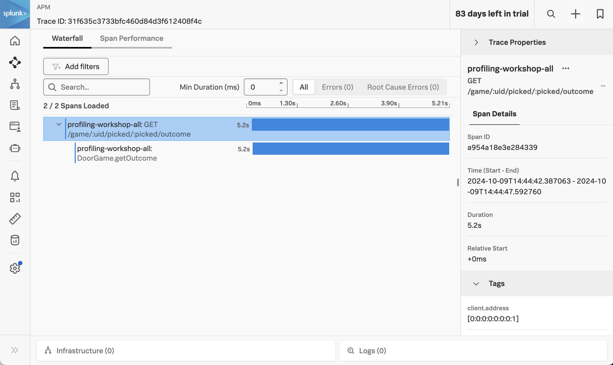
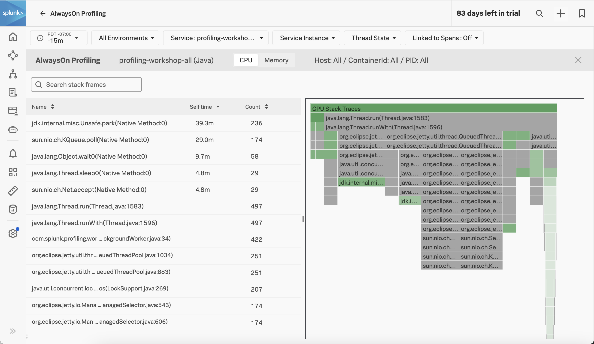
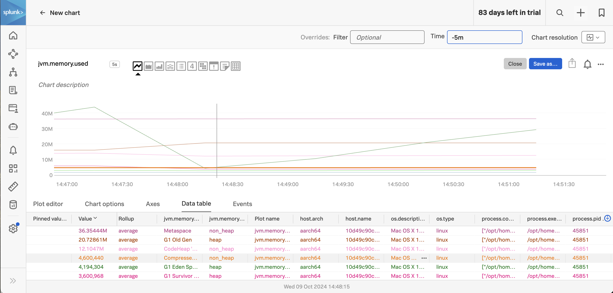

# Instrumenting a Java Application with OpenTelemetry

This example demonstrates how to instrument a Java Application using OpenTelemetry, 
and export traces, metrics, and logs to a local collector, which will then 
export that data to Splunk. We'll use Java 21 for this example, but the steps 
for earlier Java versions are similar.  

We'll show how the splunk-otel-javaagent.jar file can be downloaded and added
to the application startup command.  

Alternatively, you can add the `--with-instrumentation` command when starting the 
collector on Linux, and have it automatically instrument any Java applications 
on the host with a specific annotation.  Please refer to
[Automatic discovery and configuration for back-end applications in Linux](https://docs.splunk.com/observability/en/gdi/opentelemetry/automatic-discovery/linux/linux-backend.html) 
for further details on this approach. 

## Prerequisites

The following tools are required to build and execute the Java application: 

* Java 21 JDK
* A Linux-compatible host (such as Ubuntu 24.04, or Mac OS)
* [Gradle](https://docs.gradle.org/current/userguide/installation.html)

## Deploy the Splunk OpenTelemetry Collector

This example requires the Splunk Distribution of the OpenTelemetry collector to 
be running on the host and available via http://localhost:4318.  Follow the 
instructions in [Install the Collector for Linux with the installer script](https://docs.splunk.com/observability/en/gdi/opentelemetry/collector-linux/install-linux.html#install-the-collector-using-the-installer-script) 
to install the collector on your host. 

## Build and Execute the Application

Open a command line terminal and navigate to the root of the directory.  
For example:

````
cd ~/splunk-opentelemetry-examples/instrumentation/java/linux/doorgame
````

### Build the application JAR file

Next, we'll build the application: 

````
./gradlew shadowJar
````

### Download the latest splunk-otel-javaagent.jar file

Let's download the latest splunk-otel-javaagent.jar file, which we'll use 
to instrument our Java application: 

````
curl -L https://github.com/signalfx/splunk-otel-java/releases/latest/download/splunk-otel-javaagent.jar \
-o splunk-otel-javaagent.jar
````

### Execute the application

Next, we'll execute the application and include splunk-otel-javaagent.jar:

````
java -javaagent:splunk-otel-javaagent.jar -Dsplunk.profiler.enabled=true -Dsplunk.profiler.memory.enabled=true -jar build/libs/profiling-workshop-all.jar
````

Note that we've enabled both the CPU and memory profiler, so we can utilize the 
AlwaysOn Profiling capabilities. 

Access the application by navigating your web browser to the following URL: 

````
http://localhost:9090/
````

The application should look like the following: 


### View Traces in Splunk Observability Cloud

After a minute or so, you should start to see traces for the Java application
appearing in Splunk Observability Cloud:



### View AlwaysOn Profiling Data in Splunk Observability Cloud

You should also see profiling data appear: 



### View Metrics in Splunk Observability Cloud

Metrics are collected by splunk-otel-javaagent.jar automatically.  For example, 
the `jvm.memory.used` metric shows us the amount of memory used in the JVM 
by type of memory: 



### View Logs with Trace Context

The Splunk Distribution of OpenTelemetry Java automatically adds trace context 
to logs. However, it doesn't add this context to the actual log file (unless 
you explicitly configure the logging framework to do so).  Instead, the trace 
context is added behind the scenes to the log events exported to the 
OpenTelemetry Collector. 

For example, if we add the debug exporter to the logs pipeline of the collector, 
we can see that the trace_id and span_id have been added to the following log event 
for our application: 

````
splunk-otel-collector-1  | ScopeLogs #0
splunk-otel-collector-1  | ScopeLogs SchemaURL: 
splunk-otel-collector-1  | InstrumentationScope com.splunk.profiling.workshop.DoorGame 
splunk-otel-collector-1  | LogRecord #0
splunk-otel-collector-1  | ObservedTimestamp: 2024-10-09 22:24:20.878047 +0000 UTC
splunk-otel-collector-1  | Timestamp: 2024-10-09 22:24:20.87802 +0000 UTC
splunk-otel-collector-1  | SeverityText: INFO
splunk-otel-collector-1  | SeverityNumber: Info(9)
splunk-otel-collector-1  | Body: Str(Starting a new game)
splunk-otel-collector-1  | Trace ID: 5d6747dc9a1f69a5879c076ac0943e05
splunk-otel-collector-1  | Span ID: d596e1684d358fe0
splunk-otel-collector-1  | Flags: 1
````

The OpenTelemetry Collector can be configured to export log data to 
Splunk platform using the Splunk HEC exporter.  The logs can then be made
available to Splunk Observability Cloud using Log Observer Connect.  This will
provide full correlation between spans generated by Java instrumentation
with metrics and logs. 